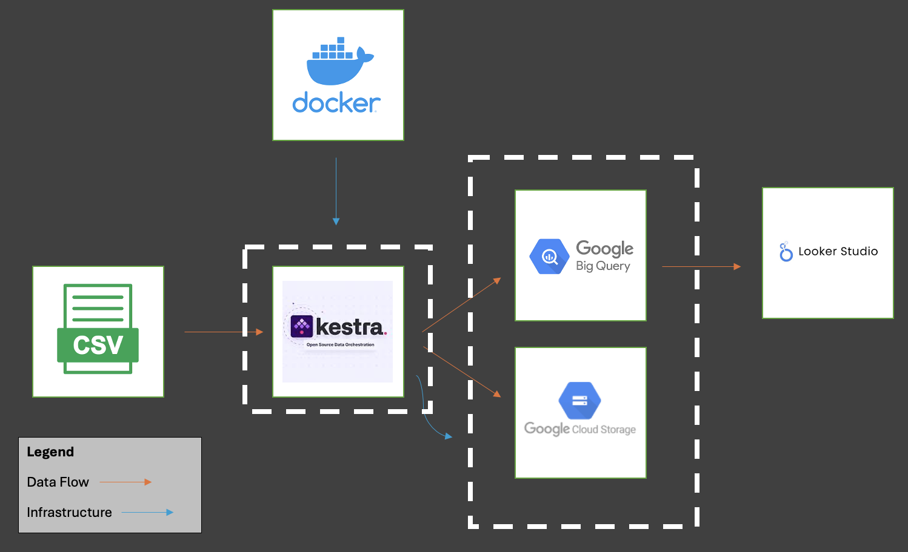

# Meteorite Data Pipeline with Dashboard
*Data Engineer Zoomcamp 2025 Final Project*

## Purpose of this project:
The purpose of this project is to ingest meteorite data collected by the Meteoritical Society and present statistical and location information in a easy-to-interpret dashboard. There are several pyspark notebooks which utilize this data on Kaggle to interpret various insights, but I wanted to add a visual map to highlight the hotspots of meteorite discovery using looker studio.

## Dataset used in this project:
Dataset: https://catalog.data.gov/dataset/meteorite-landings \
Download: https://data.nasa.gov/api/views/gh4g-9sfh/rows.csv?accessType=DOWNLOAD

## Project Description:
### Technologies Used
* **Cloud Technologies:** Google Cloud Storage, Google Big Query, Google Looker Studio
* **Infrastructure as Code:** Kestra is used to provision and destroy resources required to run the project
* **Data Warehouse:** Data is stored in Google BigQuery using clustered tables.  Partitioning was not feasible based on the lack of complete timestamps, however this was overcome by clustering on the 'year' column. Additional cluster fields include 'fall' and 'recclass' for improving efficiency for queries used in the dashboard based on status and classification of the object. 
* **Data Ingestion:** Kestra is used to orchestrate the environment and data pipeline. This project extracts a csv file directly from the dataset provider directly to load into Google Big Query in addition to uploading a copy into a Google Cloud Storage bucket. Streaming is not included due to the way the data is published.
* **Dashboard:** A Google Looker dashboard is included which provides insights on the number of found or fallen objects, the average mass of all objects, a geographic cluster map, a pie line chart showing trends over time for found and fallen objects, as well as a pie chart showing the breakdown of composition for objects discovered.


## Running This Project:



1. Download the project to your local storage
```
wget https://github.com/rasj81/MeteoriteAnalytics/archive/refs/heads/main.zip
```
2. Navigate to the environment folder and start the docker-compose instance of Kestra
```
cd ./environments/env0
```
3. Open Kestra at 127.0.0.1:8080
```
https://127.0.0.1:8080
```
6. In the Kestra dashboard, navigate to "Flows" and select "Import"
7. Navigate to the ../../Workflows folder and import the 4 workflow files. \
*Repeat steps 6 and 7 if necessary to upload all 4*
> 1-SetupKeystore.yaml
> 2-SetupEnvironment.yaml
> 3-IngestData.yaml
> 4-DeleteEnvironment.yaml
8. Edit *1-SetupKeystore.yaml* to use your GCP project settings (ProjectID, Credentials, Bucket Name, Dataset Name, and Location)
```
id: 1-SetupKeystore
namespace: meteorite

## Update Values for ProjectID, BucketName, Dataset, and credentials

tasks:
  - id: gcp_project_id
    type: io.kestra.plugin.core.kv.Set
    key: GCP_PROJECT_ID
    kvType: STRING
    value: your_project_id # TODO replace with your project id  

  - id: gcp_bucket_name
    type: io.kestra.plugin.core.kv.Set
    key: GCP_BUCKET_NAME
    kvType: STRING
    value: your_meteorite_bucket # TODO make sure it's globally unique!

  - id: gcp_dataset
    type: io.kestra.plugin.core.kv.Set
    key: GCP_DATASET
    kvType: STRING
    value: your_meteorite_dataset # TODO replace with your dataset name

  - id: gcp_location
    type: io.kestra.plugin.core.kv.Set
    key: GCP_LOCATION
    kvType: STRING
    value: us-east1

  - id: gcp_creds
    type: io.kestra.plugin.core.kv.Set
    key: GCP_CREDS
    kvType: JSON
    value: |
      {
        # TODO replace with your service credentials json
      }
```
9. Run the first 3 flows in order to:
    * 1-SetupKeystore.yaml: Create Key/Value store for the "Meteorite" namespace
    * 2-SetupEnvironment.yaml: Setup resources on Google Cloud Platform
    * 3-IngestData.yaml: Extract CSV file from datasource and process through Kestra and store in BigQuery/CloudStorage
10. You can now go into Google Cloud Console and review the data that has been created in the *meteorite* dataset
11. Review the Google Looker Studio dashboard
```
https://lookerstudio.google.com/reporting/b2f16ca0-8050-42a8-ac23-7aadfb6cda55 
```
13. If you are done, you can run the flow *4-DeleteEnvironment.yaml* to remove the resources created
